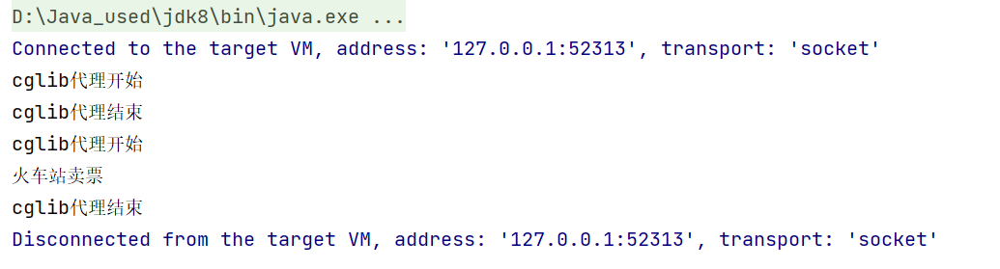

# 代理模式
## 代理（Proxy）模式分为三种角色：
* 抽象主题（Subject）类： 通过接口或抽象类声明真实主题和代理对象实现的业务方法。
* 真实主题（Real Subject）类： 实现了抽象主题中的具体业务，是代理对象所代表的真实对象，是最终要引用的对象。
* 代理（Proxy）类 ： 提供了与真实主题相同的接口，其内部含有对真实主题的引用，它可以访问、控制或扩展真实主题的功能。

## 静态代理

## jdk动态代理
  JDK动态代理要求必须定义接口，对接口进行代理。

## cglib动态代理
idea中debug时重复输出的问题

原因：单步调试时IDEA会调用被代理类的toString()方法，代理UserDao类会代理该类的所有方法（包括toString），因此会重复输出时间。

如果有接口使用JDK动态代理，如果没有接口使用CGLIB代理。

## 优点：
- 代理模式在客户端与目标对象之间起到一个中介作用和保护目标对象的作用；
- 代理对象可以扩展目标对象的功能；
- 代理模式能将客户端与目标对象分离，在一定程度上降低了系统的耦合度；

## 缺点：
* 增加了系统的复杂度；

